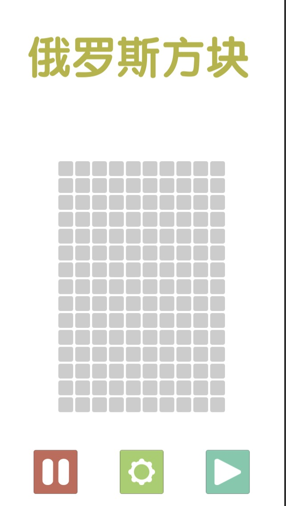
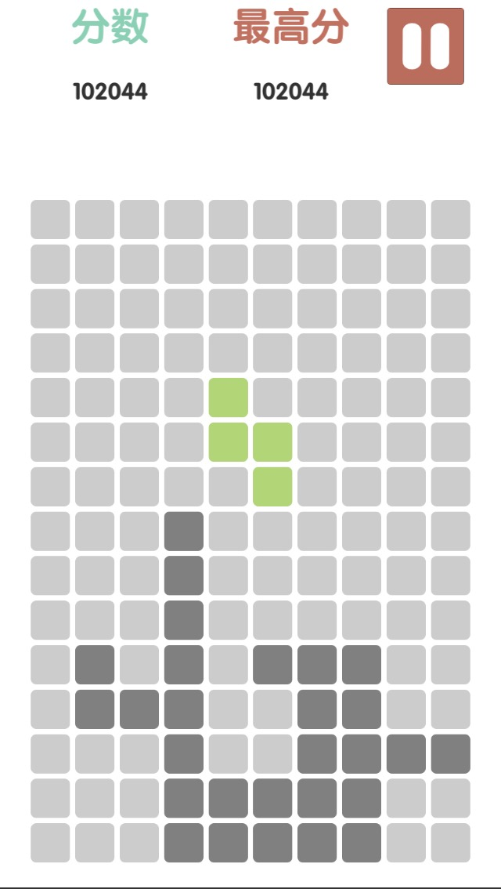
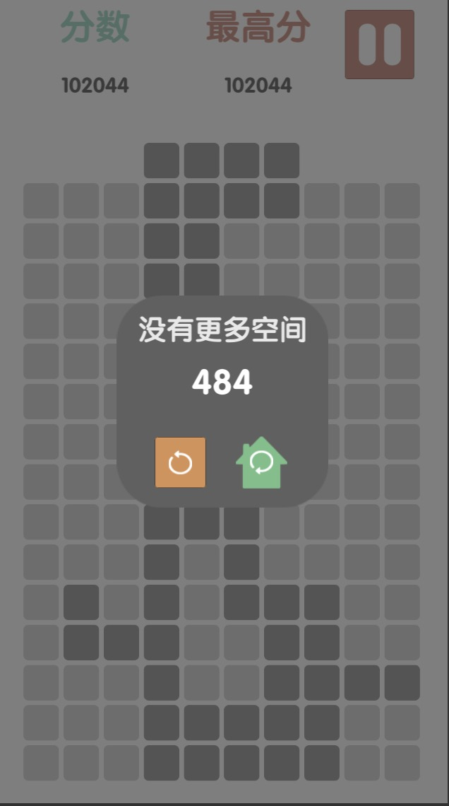

# 俄罗斯方块






---

# 当前环境:

```
Unity version: 2018.2.14f1
Script Editor: Rider2018.2
Build Platforms : Windows| Mac
GUI          : UGUI
Animation    : DoTween
```


# 下载地址: 
[https://github.com/xiaomoinfo/Tetris/releases](https://github.com/xiaomoinfo/Tetris/releases)


# 按键

```
W: 变形
A: 左移
D: 右移
S: 下落
```
